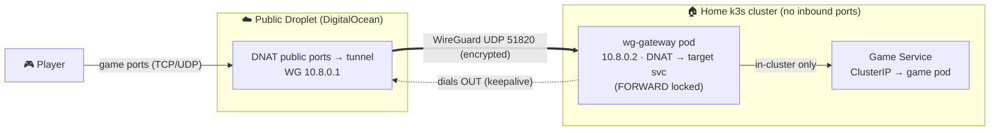
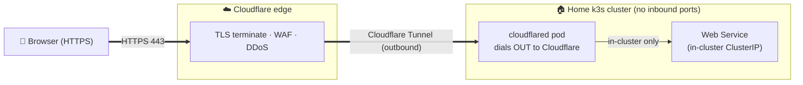

<div align="center">


**One UI to expose home-hosted services — game servers on raw ports, web apps on 80/443 — without opening a single port on your router.**

</div>

---

ProxyCTL is a single Go binary with an embedded web UI. It runs **two different routing planes**, side by side, because the right tool depends on the protocol:

1. **🎮 Game / L4 entries** — raw TCP/UDP on arbitrary ports (Source-engine games, Minecraft, Valheim, anything non-HTTP) tunneled through your $4 droplet over WireGuard to an in-cluster gateway.
2. **🌐 Web / L7 routes** — one-click **Cloudflare Tunnel** setup via the Cloudflare API. `cloudflared` runs in your cluster and dials Cloudflare's edge outbound, so 80/443 traffic to any in-cluster Service rides Cloudflare's free TLS + WAF + DDoS protection — no droplet, no public IP, no certs on your side.

Both planes use your ambient `ssh` + `kubectl` only at apply time. ProxyCTL holds zero standing credentials.

---

## ⚡ Install

One command, against your current `kubectl` context:

```bash
curl -fsSL https://proxyctl.cc/install.sh | bash
```

Zero config — it pulls the public image, detects your cluster's networking
(ingress / MetalLB), picks how to expose the UI, applies the manifest, and
hands you to first-run setup.

**Optional overrides** — set any of these before the command (or `export`
them) to customise; all are optional:

```bash
PROXYCTL_HOST=proxyctl.example.com \
PROXYCTL_EXPOSE=ingress \
  bash -c "$(curl -fsSL https://proxyctl.cc/install.sh)"
```

### Tear down / start over

```bash
kubectl delete -f k8s/proxyctl.yaml
```

Removes the namespace and everything in it (Deployment, Service, Ingress, PVC,
ProxyCTL-created `proxyctl-auth` Secret). Redeploying returns you to the
bootstrap-token step with a fresh token.

---

## 📋 Pre-requisites

Two things, both cheap, both one-time:

1. **☁️ A DigitalOcean droplet** — the cheapest **$4/mo Basic** tier is plenty for most home game servers; size up only if you actually saturate it. Sign up: **[digitalocean.com](https://www.digitalocean.com/)**.
   - The droplet runs WireGuard + iptables only. ProxyCTL only logs in for Apply.
2. **🌐 A Cloudflare-managed domain** — for the public subdomain players/users connect to. Register or transfer at **[Cloudflare Registrar](https://www.cloudflare.com/products/registrar/)**, or use any registrar and point its NS at Cloudflare.
   - Domains run **~$8-10/year**.
   - One A record per game points `<game>.example.com` → droplet IP.

That's it. **You do not install anything on the droplet by hand** — ProxyCTL's in-app Setup wizard SSHes in and installs `wireguard` / `iptables` / `conntrack`, persists kernel sysctls, generates the WireGuard keypair, and brings up `wg-quick@wg0`. Idempotent — safe to re-run any time.

You probably also want a home Kubernetes cluster (k3s works great) where your game pods actually live.

---

## ✨ Why ProxyCTL

- **Two transport planes, one UI** — raw game ports through your droplet's WireGuard tunnel, HTTP apps through a Cloudflare Tunnel with edge protection. Pick the right one per service.
- **One-click Cloudflare Tunnel** — provisions the tunnel via the CF API, deploys `cloudflared` in your cluster, pushes ingress rules, upserts proxied CNAMEs. No certs, no router config, no public IP.
- **No home ports opened** — both planes dial outbound from your cluster; your home IP stays private.
- **Zero stored credentials** — your `ssh-agent` + `kubectl` context are borrowed at click-time only.
- **Live target picker** — browse namespaces → services in your cluster; auto-fills ClusterIP + ports.
- **One binary** — Go + embedded HTML/CSS/JS, single `//go:embed` deploy.

---

## 📸 Screenshots

<p align="center">
  <em>(entries list — coming)</em>
</p>

<table>
  <tr>
    <td width="50%" valign="top"><em>(add-entry form + live cluster picker — coming)</em></td>
    <td width="50%" valign="top"><em>(apply runbook + per-step output — coming)</em></td>
  </tr>
</table>

---

## 🏗 Architecture

### 🎮 Game / L4 — WireGuard tunnel via your droplet

For raw UDP/TCP on arbitrary ports. Cloudflare's free tunnel won't carry these, so this is the path for Source-engine games, Minecraft, Valheim, anything non-HTTP.



### 🌐 Web / L7 — Cloudflare Tunnel via cloudflared

For 80/443 apps — dashboards, Jellyfin, anything HTTP. **No droplet involved**, no public IP, no certs to manage on your side.



---

## 🔐 Security

- ProxyCTL holds **zero standing credentials**. SSH and kubectl are borrowed from the ambient shell only at apply time.
- The auth Secret (`proxyctl-auth`) is written by ProxyCTL itself at first-run setup via its own ServiceAccount — same bootstrap-token flow as GameCTL.
- Cluster picker is **read-only** (`kubectl get` verbs only), only fires on click, never in the background.

Full model: [`SECURITY.md`](SECURITY.md).

---

## 📝 Notes

- Game / L4 routing is **port + protocol only** (Source-engine clients don't send hostnames). Subdomain/service fields on each entry are cosmetic reminders.
- This repo is a clean evolution of the internal `gameproxy` app — the in-process userspace forwarder + UFW automation are gone; the tunnel replaced them.
- The embedded UI is plain HTML/CSS/JS (no React/Vite) so the binary stays a single `//go:embed` artifact. Visual styling tracks GameCTL's so a future merge is natural.
