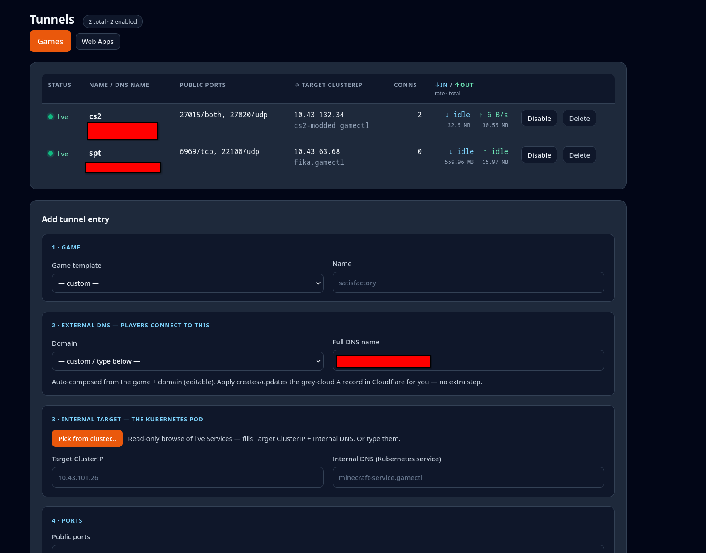
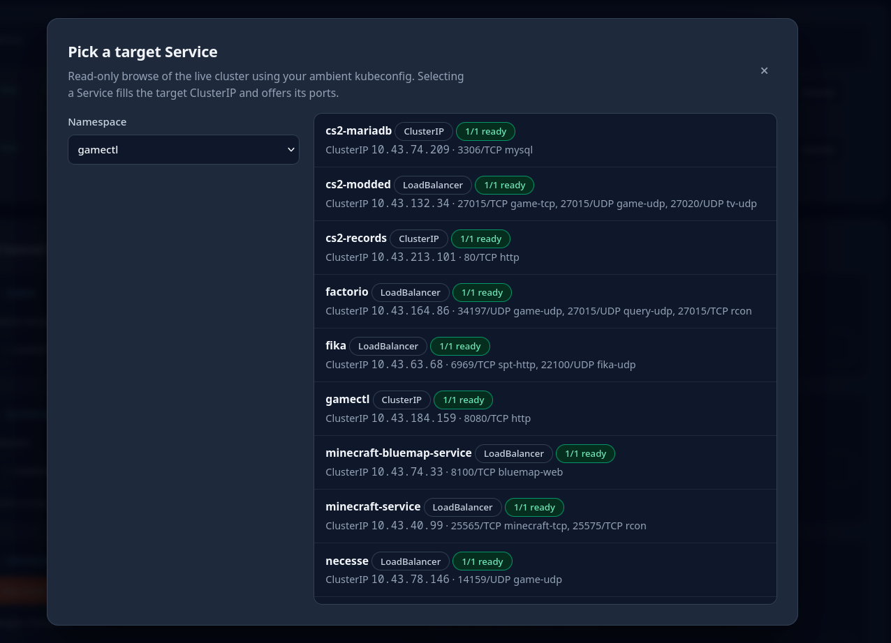
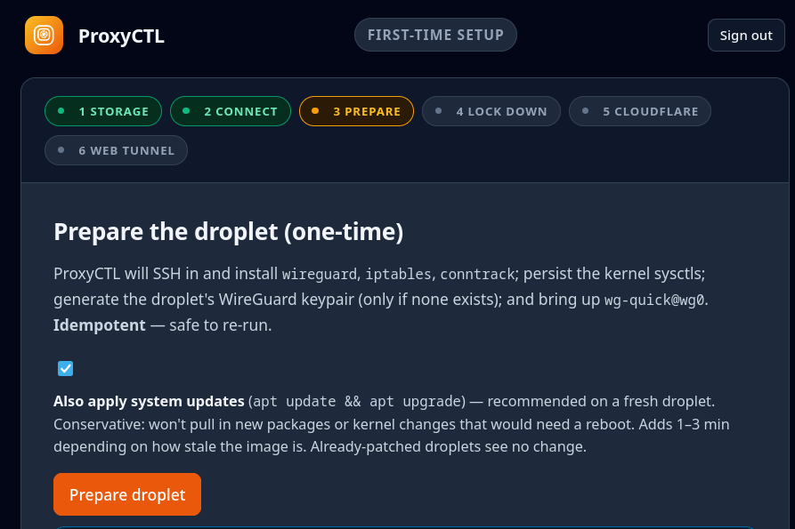
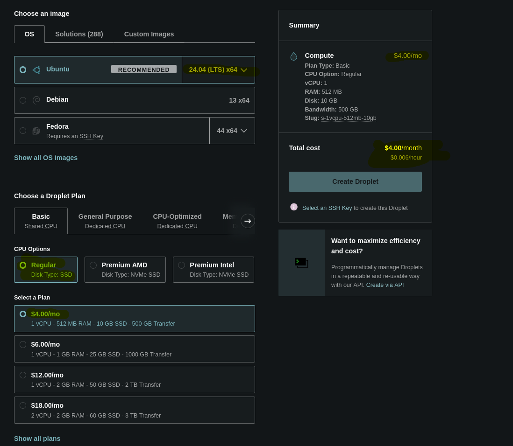
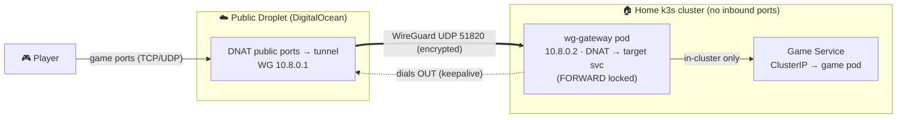
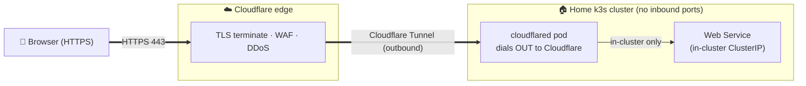

<div align="center">


**One UI to expose home-hosted services — game servers on raw ports, web apps on 80/443 — without opening a single port on your router.**

🌐 **[proxyctl.cc](https://proxyctl.cc)** &nbsp;·&nbsp; 🔗 **Sibling: [GameCTL](https://gamectl.cc)** — deploys & manages the game servers ProxyCTL publishes

</div>

---

ProxyCTL is a single Go binary with an embedded web UI. It runs **two different routing planes**, side by side, because the right tool depends on the protocol:

1. **🎮 Game / L4 entries** — raw TCP/UDP on arbitrary ports (Source-engine games, Minecraft, Valheim, anything non-HTTP) tunneled through your $4 droplet over WireGuard to an in-cluster gateway.
2. **🌐 Web / L7 routes** — one-click **Cloudflare Tunnel** setup via the Cloudflare API. `cloudflared` runs in your cluster and dials Cloudflare's edge outbound, so 80/443 traffic to any in-cluster Service rides Cloudflare's free TLS + WAF + DDoS protection — no droplet, no public IP, no certs on your side.

Both planes use your ambient `ssh` + `kubectl` only at apply time. ProxyCTL holds zero standing credentials.

> **Sibling project to [GameCTL](https://gamectl.cc).** GameCTL deploys and
> manages dedicated game servers on your cluster; ProxyCTL is how you host
> them **on the public internet, securely** — plus any web app you
> self-host. Same single-binary design, same bootstrap-token first-run
> setup, same one-command install. Use either alone; together they take a
> game from "deployed on my homelab" to "friends are connecting from
> anywhere" without a single opened router port.

---

## ⚡ Install

One command, against your current `kubectl` context:

```bash
curl -fsSL https://proxyctl.cc/install.sh | bash
```

Zero config — it pulls the public image, detects your cluster's networking
(ingress / MetalLB), picks how to expose the UI, applies the manifest, and
hands you to first-run setup.

**Optional overrides** — set any of these before the command (or `export`
them) to customise; all are optional:

```bash
PROXYCTL_HOST=proxyctl.example.com \
PROXYCTL_EXPOSE=ingress \
  bash -c "$(curl -fsSL https://proxyctl.cc/install.sh)"
```

### Tear down / start over

```bash
kubectl delete -f k8s/proxyctl.yaml
```

Removes the namespace and everything in it (Deployment, Service, Ingress, PVC,
ProxyCTL-created `proxyctl-auth` Secret). Redeploying returns you to the
bootstrap-token step with a fresh token.

---

## 📋 Pre-requisites

Two things, both cheap, both one-time:

1. **☁️ A DigitalOcean droplet** — the cheapest **$4/mo Basic** tier is plenty for most home game servers; size up only if you actually saturate it. Sign up: **[digitalocean.com](https://www.digitalocean.com/)**.
   - The exact plan to pick when creating the droplet:

     | Setting | Value |
     |---|---|
     | Image | **Ubuntu 24.04 (LTS) x64** |
     | Plan type | **Basic** (Shared CPU) |
     | CPU option | **Regular** (Disk: SSD) |
     | Size | **$4/mo** — 1 vCPU · 512 MB RAM · 10 GB SSD · 500 GB transfer (slug `s-1vcpu-512mb-10gb`, ~$0.006/hr) |
     | Auth | **Add your SSH key** at creation (required — ProxyCTL uses your `ssh-agent`, there is no password flow) |

   - That's the whole spec — the droplet runs WireGuard + iptables only, which is
     nearly idle even with a full server; 512 MB is plenty. ProxyCTL only logs
     in for Apply and the one-time Prepare step.
     ([what that looks like in the DigitalOcean creator](screenshots/DropletPlan.png))
2. **🌐 A Cloudflare-managed domain** — for the public subdomain players/users connect to. Register or transfer at **[Cloudflare Registrar](https://www.cloudflare.com/products/registrar/)**, or use any registrar and point its NS at Cloudflare.
   - Domains run **~$8-10/year**.
   - One A record per game points `<game>.example.com` → droplet IP — and with
     the Cloudflare API hooked up (next section) **ProxyCTL creates and manages
     those records for you**; you never open the Cloudflare dashboard per server.

That's it. **You do not install anything on the droplet by hand** — ProxyCTL's in-app Setup wizard SSHes in and installs `wireguard` / `iptables` / `conntrack`, persists kernel sysctls, generates the WireGuard keypair, and brings up `wg-quick@wg0`. Idempotent — safe to re-run any time.

You probably also want a home Kubernetes cluster where your game pods actually live — **[k3s](https://k3s.io/)** is what ProxyCTL (and its sibling GameCTL) are developed and run on: a single-binary, lightweight Kubernetes that installs on any Linux box with one command.

---

## 🔑 Cloudflare API token — one-time setup, exact permissions

Hook a **scoped Cloudflare API token** into ProxyCTL and DNS stops being a
separate chore: you control and associate domains to servers **entirely
inside the app**. Concretely, with the token configured ProxyCTL will:

- **Game / L4 entries** — auto-create/update the **grey-cloud A record**
  (`<game>.example.com` → droplet IP, DNS-only, `proxied: false`) when you
  Apply an entry, and optionally delete it when you delete the entry.
- **Web / L7 routes** — create the **Cloudflare Tunnel** itself via the API,
  fetch its run token for the in-cluster `cloudflared`, push ingress rules,
  and upsert the **proxied (orange-cloud) CNAME** (`app.example.com` →
  `<tunnel-id>.cfargotunnel.com`). If a conflicting A record exists on that
  hostname, ProxyCTL removes it first (a name can't hold both).
- **Everywhere** — list your zones so domain dropdowns are pre-filled, and
  verify the token with a **Save & test** button before anything is applied.

### Creating the token, step by step

1. Log in at **[dash.cloudflare.com](https://dash.cloudflare.com)** → click
   your avatar (top right) → **My Profile** → **API Tokens** →
   **Create Token** → scroll down and choose **Custom token → Get started**.
   *(Don't use a pre-made template — none matches this exact scope set — and
   never use the **Global API Key**: it can do anything to your whole account
   and can't be restricted.)*
2. Name it something recognizable, e.g. `proxyctl`.
3. Add **exactly these four permissions** (row by row — the three dropdowns
   per row are *scope · resource · access level*):

   | Scope | Permission | Access | Why ProxyCTL needs it |
   |---|---|---|---|
   | **Account** | **Cloudflare Tunnel** | **Edit** | Create the tunnel, read its status, fetch the `cloudflared` run token, and push per-hostname ingress configurations (`/accounts/…/cfd_tunnel*`). |
   | **Account** | **Account Settings** | **Read** | List your accounts once to resolve the account ID the tunnel lives under (`GET /accounts`). No settings are ever changed. |
   | **Zone** | **Zone** | **Read** | List your zones and resolve `example.com` → zone ID, and pre-fill the domain dropdowns (`GET /zones`). |
   | **Zone** | **DNS** | **Edit** | Create/update/delete the A records (games) and proxied CNAMEs (web routes) (`/zones/…/dns_records`). |

4. **Account Resources** — `Include` → your account (pick it by name; if you
   only have one account, select it explicitly anyway).
5. **Zone Resources** — `Include` → **All zones** is simplest. If you prefer
   least-privilege, choose **Specific zone** and add each domain you'll route
   through ProxyCTL — but note only those zones will appear in the app, and
   Applies against any other domain will fail with a permissions error.
6. *(Optional hardening)* **Client IP Address Filtering** — restrict the
   token to your home IP (where ProxyCTL runs). **TTL** — give the token an
   expiry and rotate it; ProxyCTL re-verifies on save, so pasting a fresh
   token later is a 10-second job.
7. **Continue to summary → Create Token**, and copy the token — Cloudflare
   shows it **once**.

### Giving the token to ProxyCTL

Two ways, both fine:

- **In the UI (recommended)** — first-run Setup wizard, **Cloudflare** step:
  paste the token and hit **Save & test**. ProxyCTL calls
  `GET /user/tokens/verify` and shows the token's status (active / expired /
  disabled) before accepting it.
- **Env var** — set `CF_API_TOKEN` (or `CLOUDFLARE_API_TOKEN`) on the
  ProxyCTL Deployment; it's read once at startup.

Either way the token is held **in memory only** — never written to disk,
never logged, never sent to the browser. That also means a pasted token
doesn't survive a pod restart: re-paste it, or use the env var if you want
it permanent.

### If the token is wrong, here's how it fails

- **Save & test fails** → the token itself is invalid/expired (step 7 copy
  mistake, or TTL lapsed).
- **Web-route Apply fails creating the tunnel** → missing
  `Account · Cloudflare Tunnel · Edit`, or Account Resources didn't include
  the right account.
- **"zone not found" on Apply** → missing `Zone · Zone · Read`, or the domain
  isn't in the token's Zone Resources include list.
- **DNS record create/update fails** → missing `Zone · DNS · Edit` for that
  zone.

No token at all is also fine — game entries still work; you just create the
A records in the Cloudflare dashboard by hand, and the one-click web-tunnel
plane is unavailable.

---

## ✨ Why ProxyCTL

- **Two transport planes, one UI** — raw game ports through your droplet's WireGuard tunnel, HTTP apps through a Cloudflare Tunnel with edge protection. Pick the right one per service.
- **One-click Cloudflare Tunnel** — provisions the tunnel via the CF API, deploys `cloudflared` in your cluster, pushes ingress rules, upserts proxied CNAMEs. No certs, no router config, no public IP.
- **Domains managed in-app** — hook up a [scoped Cloudflare API token](#-cloudflare-api-token--one-time-setup-exact-permissions) and ProxyCTL creates/updates the DNS records itself: grey-cloud A records for game servers, proxied CNAMEs for web apps. Associate a domain with a server without ever opening the Cloudflare dashboard.
- **No home ports opened** — both planes dial outbound from your cluster; your home IP stays private.
- **Zero stored credentials** — your `ssh-agent` + `kubectl` context are borrowed at click-time only.
- **Live target picker** — browse namespaces → Services in your cluster (type, ClusterIP, ports, pod readiness) and click one; the proxy is associated **directly with the in-cluster Service**, not a port-forward. ([see it](screenshots/TargetPicker.png))
- **Made for GameCTL servers** — the picker sees the Services [GameCTL](https://gamectl.cc) creates, so publishing a game server is: pick the Service, pick the ports, Apply. Live per-tunnel traffic counters show players connecting.
- **One binary** — Go + embedded HTML/CSS/JS, single `//go:embed` deploy.

---

## 📸 Screenshots

<p align="center">
  <br>
  <em>The Tunnels dashboard — live entries with per-tunnel traffic counters, plus the guided add-entry form (DNS, cluster target picker, ports)</em>
</p>

<p align="center">
  <br>
  <em>The live target picker — browse your cluster's actual Services (type, ClusterIP, ports, pod readiness) and click one. The tunnel binds <b>directly to the in-cluster Service</b> — no NodePort, no port-forward hops, no copy-pasting IPs.</em>
</p>

<table>
  <tr>
    <td width="50%" valign="top">
      <br>
      <em>First-run setup wizard — ProxyCTL preps the droplet itself: WireGuard, iptables, sysctls, keypair. Idempotent.</em>
    </td>
    <td width="50%" valign="top">
      <br>
      <em>The whole cloud bill — DigitalOcean's $4/mo Basic droplet is all the tunnel needs.</em>
    </td>
  </tr>
</table>

---

## 🏗 Architecture

### 🎮 Game / L4 — WireGuard tunnel via your droplet

For raw UDP/TCP on arbitrary ports. Cloudflare's free tunnel won't carry these, so this is the path for Source-engine games, Minecraft, Valheim, anything non-HTTP.



### 🌐 Web / L7 — Cloudflare Tunnel via cloudflared

For 80/443 apps — dashboards, Jellyfin, anything HTTP. **No droplet involved**, no public IP, no certs to manage on your side.



---

## 🔐 Security

- ProxyCTL holds **zero standing credentials**. SSH and kubectl are borrowed from the ambient shell only at apply time.
- The auth Secret (`proxyctl-auth`) is written by ProxyCTL itself at first-run setup via its own ServiceAccount — same bootstrap-token flow as GameCTL.
- Cluster picker is **read-only** (`kubectl get` verbs only), only fires on click, never in the background.

Full model: [`SECURITY.md`](SECURITY.md).

---

## 📝 Notes

- Game / L4 routing is **port + protocol only** (Source-engine clients don't send hostnames). Subdomain/service fields on each entry are cosmetic reminders.
- This repo is a clean evolution of the internal `gameproxy` app — the in-process userspace forwarder + UFW automation are gone; the tunnel replaced them.
- The embedded UI is plain HTML/CSS/JS (no React/Vite) so the binary stays a single `//go:embed` artifact. Visual styling tracks GameCTL's so a future merge is natural.
