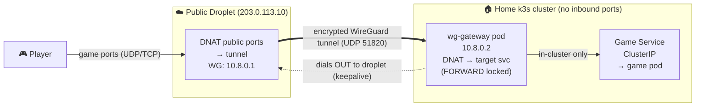

# ProxyCTL

Single-binary Go service + embedded web UI to manage the **per-entry
DNAT/FORWARD rules** for the examplelabs WireGuard game tunnel.

Players hit a public cloud droplet; traffic rides an encrypted WireGuard
tunnel to an in-cluster `wg-gateway`, which hands it to the target game
Service. The tunnel + keys are **shared base infra** (set up once — see
`wireguard/WIREGUARD.md`). What changes per game is just two iptables
blocks: the droplet's DNAT into the tunnel, and the gateway's DNAT on to a
target ClusterIP. ProxyCTL owns those two blocks: you describe **entries**
in the UI, it renders both configs, and (optionally) applies them.

> Experimental / side project. Separate from GameCTL; may be merged later.

## Architecture it manages



```
   Player ──► PUBLIC DROPLET 203.0.113.10 ──(WG tunnel UDP 51820)──►
              DNAT ports → 10.8.0.2              WG GATEWAY POD 10.8.0.2
                                                 DNAT → target ClusterIP → game pod
              (home dials OUT — no home ports opened, home IP hidden)
```

See `wireguard/WIREGUARD.md` for the full runbook of the base infra
ProxyCTL drives.

## Where to run ProxyCTL (internal-only)

ProxyCTL is an **internal operator tool**. Run it where the operator's
ambient ssh + kubeconfig live: an operator workstation on the LAN, or a
host with internal/in-cluster cluster access. The admin UI stays
loopback-bound + token-protected; reach it locally or via an SSH tunnel.

- **Do NOT run ProxyCTL on the public droplet.** The droplet is purely
  the WireGuard data path: it only ever sees game UDP/TCP forwarded into
  the tunnel and **never talks to the Kubernetes API**. That boundary is
  explicit in the code (`kube.go` is operator-side only; the droplet path
  is `render.go`/`applier.go` ssh only).
- **Kubernetes API access is INTERNAL ONLY.** The cluster picker uses
  *only* the ambient internal kubeconfig / in-cluster context at
  click-time, read-only, on demand. ProxyCTL never requires, assumes, or
  creates external/public reachability to the kube API and never
  tunnels/exposes it outward. Run somewhere without internal cluster
  access and the picker simply degrades to the manual ClusterIP field
  with a "cluster not reachable from here — internal access required"
  message.

## Live Kubernetes target picker

Instead of hand-typing a ClusterIP, click **Pick from cluster…** on the
add-entry form to browse the live cluster:

- Lists namespaces, then Services in the chosen namespace, showing each
  Service's **type**, **ClusterIP**, **ports** (named), and **backing pod
  readiness** (e.g. `2/2 ready`) so you can see it's a running workload.
- Selecting a Service auto-fills the entry's `targetIP` (its ClusterIP)
  and pre-fills the port list from the Service's ports. The manual
  ClusterIP field is always still there for edge cases (headless
  Services, off-cluster targets).
- Backend: `GET /api/kube/namespaces` and `GET /api/kube/services?ns=`,
  behind the same loopback + token auth as every other endpoint. Both
  shell out to the system `kubectl` with the operator's **ambient**
  environment — exactly the no-stored-creds model the SSH applier uses —
  and only ever issue read (`get`) verbs. Never background, never
  persisted, only on the operator's click.

## What an Entry maps to

An Entry: **name**, **subdomain** (cosmetic DNS label), **public ports**
(list of `port:proto`, proto = `tcp`/`udp`/`both`), **target ClusterIP**,
optional **service** label (cosmetic), **enabled**.

Routing is by port + protocol only (Source-engine clients don't send
hostnames) — the subdomain/service fields are reminders.

On every save ProxyCTL re-renders, from **all enabled entries**:

1. **Droplet `/etc/wireguard/wg0.conf`** — `[Interface]` +
   `PostUp/PostDown` iptables: per entry, `PREROUTING` DNAT of its ports
   into the tunnel (`→ 10.8.0.2`), a matching `FORWARD ACCEPT`, plus one
   shared `POSTROUTING MASQUERADE` out `wg0` so replies return.
2. **`wg-gateway` Secret + Deployment manifest** (modeled on
   `wireguard/wg-gateway.yaml`) — per entry, `PREROUTING` DNAT of its
   ports to that entry's **target ClusterIP**, a scoped `FORWARD ACCEPT`,
   a per-target `MASQUERADE`, and the blast-radius lockdown (`FORWARD …
   ESTABLISHED,RELATED ACCEPT` then `FORWARD -j DROP`) so a flow can only
   ever reach the configured targets.
3. **Apply runbook** — copy/paste `ssh`/`scp`/`kubectl` steps.

Key material is **never** rendered, stored, or held in memory: both
configs carry `__DROPLET_PRIVATE_KEY__` / `__GATEWAY_PRIVATE_KEY__`
placeholders. The ssh applier splices the existing keys back in *on the
remote side / from the live Secret* at apply-time.

## Apply model — the `Applier` seam

Apply is an explicit operator action (the **Apply now** button), never
background. It sits behind an `Applier` interface (`applier.go`) so the
store / API / UI never change when the mechanism does:

- **`ssh` (default, `-apply-mode ssh`)** — on Apply, ProxyCTL shells out
  to the system `ssh` and `kubectl` using the **operator's ambient
  credentials**: the ssh-agent / `~/.ssh` / kubeconfig already in the
  process environment of whoever launched ProxyCTL. It
  - streams the rendered `wg0.conf` to the droplet over `ssh`, splices in
    the droplet's existing `PrivateKey`, writes it, `systemctl restart
    wg-quick@wg0`, `wg show`;
  - reads the existing gateway key from the live Secret, splices it into
    the rendered manifest, `kubectl apply -f -`, `rollout status`.
  Per-command stdout/stderr/exit is surfaced verbatim in the UI.
- **`manual` (`-apply-mode manual`)** — renders + shows the runbook only,
  executes nothing. Fallback / air-gapped review.

**Security model:** ProxyCTL holds **zero standing credentials** — no SSH
key, no kubeconfig, nothing persisted. In ssh mode it *borrows* the
operator's ambient ssh/kubectl only at click-time. The admin UI stays
loopback-bound + token-protected, so "click Apply" can only be triggered
by someone who already tunnelled in as the operator. A future
command-restricted-key / scoped-kubeconfig applier can be dropped in
behind the same interface without touching anything else.

Configure the targets:

```bash
proxyctl -apply-mode ssh -droplet-ssh root@203.0.113.10 -kube-context home
```

## Run it (loopback + SSH tunnel + token)

The admin GUI defaults to `127.0.0.1:8080` — not reachable from the
internet. It **refuses to bind a public address without `-token`**.
Recommended: run it where your ssh-agent + kubeconfig live (your
workstation) and reach it locally, or tunnel in:

```bash
# build
./build.sh                       # -> dist/proxyctl

# run (loopback; ssh apply-mode borrows your ambient creds)
./dist/proxyctl -addr 127.0.0.1:8088 -db /var/lib/proxyctl/entries.json \
  -apply-mode ssh -droplet-ssh root@203.0.113.10

# reach the GUI from a laptop, if running it remotely
ssh -L 8088:127.0.0.1:8088 you@host    # then browse http://localhost:8088
```

Optional token (for use behind your existing site's TLS, no new firewall
port):

```bash
PROXYCTL_TOKEN=$(openssl rand -hex 24) ./dist/proxyctl -token "$PROXYCTL_TOKEN"
# open https://yoursite/...?token=YOURTOKEN once; HttpOnly cookie carries it.
```

Entries persist to the JSON store and survive restarts. `deploy/` has a
loopback-only systemd unit (read its credentials note before using it as a
system service — ssh mode needs ambient ssh/kubectl access).

### One-shot render (drop-in install path)

For the simplest "let traffic into a kube app" case you don't need the
server, a token, or an SSH tunnel — `-render` prints the rendered config
and exits (pure render, zero credentials, only reads the entries store):

```bash
proxyctl -render gateway  | kubectl apply -f -   # the in-cluster pod
proxyctl -render droplet                          # the droplet wg0.conf
proxyctl -render all                              # both, for review
```

Key placeholders (`__GATEWAY_PRIVATE_KEY__` etc.) are preserved — splice
the real key from the live Secret before applying; ProxyCTL never holds
key material.

## Droplet requirements

- `wireguard` / `wg-quick` + iptables (the tunnel itself).
- **`conntrack` (conntrack-tools)** — required for the live
  per-game connection / active-path counts in the UI. ProxyCTL reads
  `conntrack -L` on the droplet (it also tries `/proc/net/nf_conntrack`,
  which modern cloud kernels often don't expose). Without it the
  "Conns" column degrades gracefully to `n/a`; byte/rate stats still
  work from `wg show`. Install: `apt-get install -y conntrack`.

## Notes

- ProxyCTL never derives WireGuard keys. The droplet's *public* key (the
  gateway's `[Peer]`) is not in the runbook, so `DefaultInfra` ships it as
  a `__DROPLET_PUBLIC_KEY__` placeholder — fill from the live config.
- Base-infra facts (IPs, ports, image digest) live in `DefaultInfra()` in
  `render.go`, mirroring the live deployment in `wireguard/WIREGUARD.md`.
- This repo is a clean evolution of the internal `gameproxy` app; the
  in-process userspace forwarder + UFW automation were removed (the tunnel
  replaced them).
- The embedded web UI is restyled to match **GameCTL**'s look/feel
  (slate-950/900 dark palette, slate-800 borders, emerald primary + blue
  action buttons, rounded cards, sticky header, system-ui) so a later
  merge into GameCTL is natural. It deliberately stays plain
  embedded HTML/CSS/JS — no React/Vite build — to keep ProxyCTL a single
  `//go:embed` binary; GameCTL's UI was used as a design reference only.
