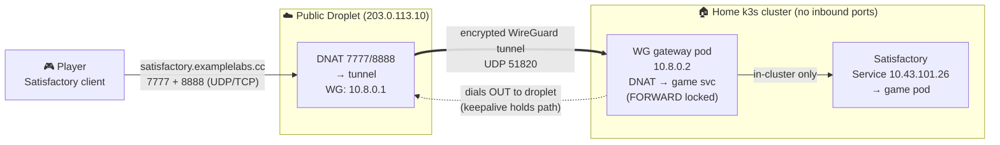

# Satisfactory over WireGuard — Architecture & Runbook

> Players connect to a public cloud droplet, which forwards game traffic through an
> encrypted **WireGuard** tunnel to a small gateway in the home Kubernetes cluster;
> the gateway hands it to the game server. The home side dials *out* to the droplet,
> so **no home ports are opened** and the home IP stays hidden — the droplet is the
> only public surface, and it can only ever route to the one game service.

---

## Picture (Mermaid — renders as a diagram on GitHub/GitLab/Notion/etc.)



## Picture (ASCII — paste anywhere)

```
   Player (Satisfactory client)
        |  satisfactory.examplelabs.cc : 7777 + 8888
        v
 +-------------------------------+
 |  PUBLIC DROPLET 203.0.113.10  |   only public surface
 |  DNAT 7777/8888 -> tunnel     |   firewall: game ports + 51820/udp + SSH(home only)
 |  WireGuard 10.8.0.1           |
 +---------------+---------------+
                 |  encrypted WireGuard tunnel (UDP 51820)
                 |  (home side dials OUT - NO home ports opened)
                 v
 +-------------------------------+
 |  WG GATEWAY POD  10.8.0.2     |   in home k3s cluster
 |  DNAT -> Satisfactory svc     |   FORWARD locked: only game svc reachable
 +---------------+---------------+
                 |  in-cluster network only
                 v
 +-------------------------------+
 |  Satisfactory Service         |   ClusterIP 10.43.101.26
 |  -> game server pod           |   follows the pod automatically
 +-------------------------------+
```

---

## How it works

1. **Tunnel setup (outbound):** the in-cluster WireGuard gateway pod dials *out* to the
   droplet (`UDP 51820`); a keepalive holds the path open. No home router ports are ever
   opened; the home WAN IP is never exposed.
2. **Player joins:** client → `satisfactory.examplelabs.cc` (→ droplet) on `7777`/`8888`.
3. **Droplet** DNATs those ports into the tunnel (MASQUERADE so replies return).
4. **Gateway pod** DNATs tunnel traffic to the Satisfactory **ClusterIP** `10.43.101.26`;
   kube-proxy routes it to the live game pod.
5. **Replies** retrace the path; kernel connection-tracking un-rewrites each hop.

**Why this works where a userspace proxy didn't:** the old proxy handled `7777` and `8888`
as two separate sockets with unrelated source addresses, so Satisfactory couldn't correlate
the game + reliable channels → reliable handshake timed out at 30 s. WireGuard carries both
ports over **one kernel-conntrack NAT path**, so the server sees one coherent connection,
exactly like a LAN client.

## Ports & exposure

| Where | Open inbound | Notes |
|---|---|---|
| Home router | **nothing** | tunnel is outbound-initiated; home IP hidden |
| Droplet | `7777`,`8888` (game), `51820/udp` (WG), `22` (SSH, home IP only) | everything else denied |
| Gateway → game | n/a | internal cluster route only |

## Security / blast radius

- WireGuard only answers cryptographically-authenticated peers — silent to scanners.
- Droplet DNAT *pins* player traffic to exactly the game service; a player cannot address
  anything else.
- Gateway pod: `FORWARD` chain DROPs everything except `→10.43.101.26:7777/8888`
  (no lateral movement), no ServiceAccount token, image pinned by digest, `NET_ADMIN` only.

## Key facts

- Droplet public: `203.0.113.10`, WG endpoint `:51820/udp`
- WG subnet: droplet `10.8.0.1/24`, gateway `10.8.0.2/24`
- Satisfactory Service ClusterIP: `10.43.101.26` (7777/8888 tcp+udp)
- k8s: `Secret/wg-gateway`, `Deployment/wg-gateway` in ns `gamectl` (manifest:
  `wg-gateway.yaml` next to this file)
- Droplet WG config: `/etc/wireguard/wg0.conf`; keys in `/etc/wireguard/`

## Emergency revert (to old userspace proxy)

On the droplet, drop the DNAT diversion — traffic falls back to the still-running
`gameproxy` systemd service:

```
iptables -t nat -F PREROUTING
```

## Status / remaining

- [x] Tunnel up, path proven end-to-end, hardened
- [x] **Real Satisfactory join confirmed working** (2026-05-18)
- [x] **Reboot-persistent both sides** — droplet `wg-quick@wg0` enabled with all
  forwarding in `wg0.conf` PostUp/PostDown; gateway is a Deployment+Secret in etcd.
  Verified clean across a unit-restart (reboot simulation).
- [ ] Optional: tighten droplet firewall further; retire userspace-proxy fallback
  (kept intentionally as an instant fallback for now)
- [ ] Future: GameCTL integration with an easy setup script (separate effort)
